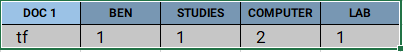
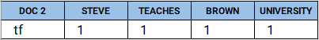
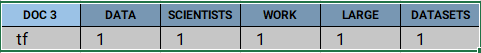
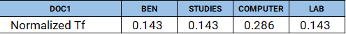
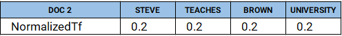
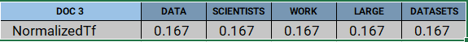
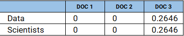

Some of the feature extraction techniques are described below
  1. Bag Of Words (BOW)
  2. N-grams
  3. Term Frequency (TF) - Inverse Document Frequency (IDF)
  4. Tfidftransformer vs. Tfidfvectorizer


## Bag Of Words (BOW)

The approach is very simple and flexible, and can be used in many ways for extracting features from documents. it involves two things.
- Building the vocabulary
- Counting the occurrence of each word.

Example:
1. *Collect data*

  ```
‘All my cats in a row’,
‘When my cat sits down, she looks like a Furby toy!’,
```

2. *Design Vocabulary*

Creating the list of words as part of building the vocabulary.
```
{‘all’: 0, ‘cat’: 1, ‘cats’: 2, ‘down’: 3, ‘furby’: 4, ‘in’: 5, ‘like’: 6, 
‘looks’: 7, ‘my’: 8, ‘row’: 9, ‘she’: 10, ‘sits’: 11, ‘toy’: 12, ‘when’: 13 }
```
All the above 14 words (dimension) are now our corpus. That means each sentence/document is represented with a length of 14 elements.

3. *Create the document vectors*
```
‘All my cats in a row’ = [1 0 1 0 0 1 0 0 1 1 0 0 0 0]
‘When my cat sits down, she looks like a Furby toy!’, = [0 1 0 1 1 0 1 1 1 0 1 1 1 1]
```
We can see that our text (documents) are converted to vectors.

*Managing the vocabulary*

We can see that the vocabulary size will keep increasing as number of documents increases. We can manage the vocabulary by doing the following.

    ignoring the case
    removing the punctuation
    removing the stop words ( 'in', 'the', 'a')
    misspelling
    stemming/lemmatizing

**Problems:**

    we lose word order, hence the name "Bag Of Words"
    Counters are not normalized.

sklearn provide a built-in library for the same.
```
from sklearn.feature_extraction.text import CountVectorizer

corpus = [
'All my cats in a row',
'When my cat sits down, she looks like a Furby toy!',
'The cat from outer space',
'Sunshine loves to sit like this for some reason.'
]

vectorizer = CountVectorizer()
print( vectorizer.fit_transform(corpus).todense() )
print("*****************************************************")
print( vectorizer.vocabulary_ ) 

output:
[[1 0 1 0 0 0 0 1 0 0 0 1 0 0 1 0 0 0 0 0 0 0 0 0 0 0]
 [0 1 0 1 0 0 1 0 1 1 0 1 0 0 0 1 0 1 0 0 0 0 0 0 1 1]
 [0 1 0 0 0 1 0 0 0 0 0 0 1 0 0 0 0 0 0 1 0 1 0 0 0 0]
 [0 0 0 0 1 0 0 0 1 0 1 0 0 1 0 0 1 0 1 0 1 0 1 1 0 0]]
*****************************************************
{'all': 0, 'my': 11, 'cats': 2, 'in': 7, 'row': 14, 'when': 25, 'cat': 1, 
'sits': 17, 'down': 3, 'she': 15, 'looks': 9, 'like': 8, 'furby': 6, 
'toy': 24,'the': 21, 'from': 5, 'outer': 12, 'space': 19, 'sunshine': 20,
'loves': 10,'to': 23, 'sit': 16, 'this': 22, 'for': 4, 'some': 18, 'reason': 13}
```


## N-grams

n-gram is a contiguous sequence of n items from a given sample of text or speech. n-gram of size 1 is referred to as a "unigram"; size 2 is a "bigram" (or, less commonly, a "digram"); size 3 is a "trigram". in this way we can preserve some ordering.

we can write pure python functions like below
```
import re


def generate_ngrams(s, n):
    # Convert to lowercases
    s = s.lower()
    
    # Replace all none alphanumeric characters with spaces
    s = re.sub(r'[^a-zA-Z0-9\s]', ' ', s)
    
    # Break sentence in the token, remove empty tokens
    tokens = [token for token in s.split(" ") if token != ""]
    
    # Use the zip function to help us generate n-grams
    # Concatentate the tokens into ngrams and return
    ngrams = zip(*[tokens[i:] for i in range(n)])
    return [" ".join(ngram) for ngram in ngrams]

s = 'All my cats in a row'
generate_ngrams(s, n=2)

output :

['all my', 'my cats', 'cats in', 'in a', 'a row']
```

also we have util function in NLTK. nltk has the ngrams function that returns a generator of n-grams given a tokenized sentence.
```
import re
from nltk.util import ngrams


s = 'All my cats in a row'
s = s.lower()
s = re.sub(r'[^a-zA-Z0-9\s]', ' ', s)
tokens = [token for token in s.split(" ") if token != ""]
output = list(ngrams(tokens, 2))
print(output)

output:

[('all', 'my'), ('my', 'cats'), ('cats', 'in'), ('in', 'a'), ('a', 'row')]
```
- [https://en.wikipedia.org/wiki/N-gram]

## Term Frequency (TF) - Inverse Document Frequency (IDF)

TF-IDF(term) = TF(term in a document) * IDF(term)

    TF(term) = # of times the term appears in document / total # of terms in document
    IDF(term) = log(total # of documents / # of documents with term in it)

Let’s us take 3 documents to show how this works.
```
Doc 1: Ben studies about computers in Computer Lab.
Doc 2: Steve teaches at Brown University.
Doc 3: Data Scientists work on large datasets.
```
**Step 1**: Computing the Term Frequency(tf)

tf for document 1:



Vector Space Representation for Doc 1 : [1, 1, 2, 1]

tf for document 2:



Vector Space Representation for Doc 2 : [1, 1, 1, 1]

tf for document 3:



Vector Space Representation for Doc 3 : [1, 1, 1, 1, 1]

Given below are the normalized term frequency for all the documents, i.e. [N(t, d) / ||D||]

Normalized TF for Document 1:



Vector Space Representation for Document 1 : [0.143, 0.143, 0.286, 0.143]

Normalized tf for document 2:



Vector Space Representation for Document 2 : [0.2, 0.2, 0.2, 0.2]

Normalized tf for document 3:



Vector Space Representation for Document 3 : [0.167, 0.167, 0.167, 0.167, 0.167]

**Step 2**: Compute the Inverse Document Frequency – idf

The main purpose of doing a search is to find out relevant documents matching the query. Since tf considers all terms equally important, thus, we can’t only use term frequencies to calculate the weight of a term in the document. However, it is known that certain terms, such as “is”, “of”, and “that”, may appear a lot of times but have little importance. Thus we need to weigh down the frequent terms while scaling up the rare ones. Logarithms helps us to solve this problem.

```
idf(t) = log(N/ df(t))

idf(computer) = log(Total Number Of Documents / Number Of Documents with term Computer in it)

The term Computer appears in Document1

idf(computer) = log(3 / 1)
              = 1.5849
```

**Step 3**: tf-idf Scoring

Now we have defined both tf and idf and now we can combine these to produce the ultimate score of a term t in document d. Therefore,
```
tf-idf(t, d) = tf(t, d)* idf(t, d)
```
For each term in the query multiply its normalized term frequency with its IDF on each document. In Document3 for the term data, the normalized term frequency is 0.167 and its IDF is 1.5849. Multiplying them together we get 0.2646. Given below is TF * IDF calculations for data and Scientists in all the documents.



## Tfidftransformer vs. Tfidfvectorizer

In summary, the main difference between the two modules are as follows:

With Tfidftransformer you will systematically compute word counts using CountVectorizer and then compute the Inverse Document Frequency (IDF) values and only then compute the Tf-idf scores.

With Tfidfvectorizer on the contrary, you will do all three steps at once. Under the hood, it computes the word counts, IDF values, and Tf-idf scores all using the same dataset. 

**When to use what?**

So now you may be wondering, why you should use more steps than necessary if you can get everything done in two steps. Well, there are cases where you want to use Tfidftransformer over Tfidfvectorizer and it is sometimes not that obvious. Here is a general guideline:

    - If you need the term frequency (term count) vectors for different tasks, use Tfidftransformer.
    - If you need to compute tf-idf scores on documents within your “training” dataset, use Tfidfvectorizer
    - If you need to compute tf-idf scores on documents outside your “training” dataset, use either one, both will work.

- [https://scikit-learn.org/stable/modules/generated/sklearn.feature_extraction.text.TfidfVectorizer.html]
- [https://www.geeksforgeeks.org/tf-idf-model-for-page-ranking/]
- [https://kavita-ganesan.com/tfidftransformer-tfidfvectorizer-usage-differences/]


