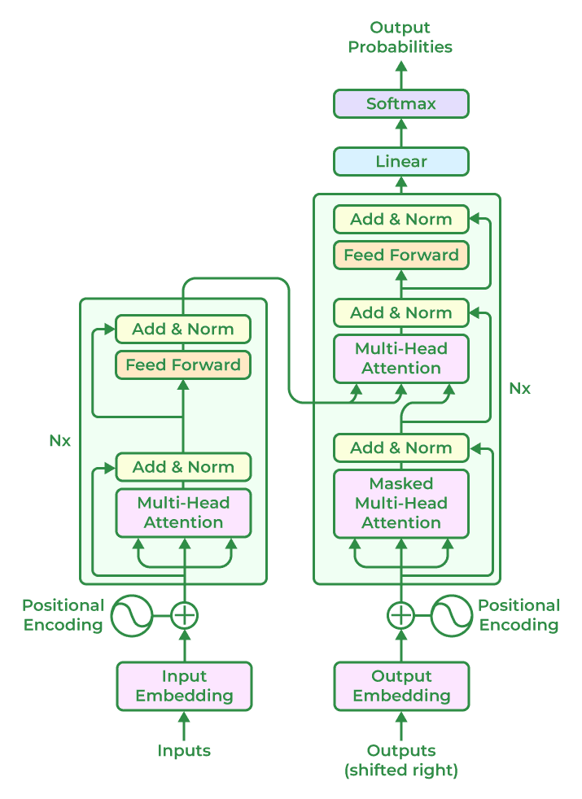

Transformer-based models, which have revolutionized natural language processing tasks, typically follow a general architecture that includes the following components:

# Transformer Architecture Diagram Breakdown:

**1. Input Embeddings:**

The input (e.g., a sentence) is first converted into embeddings (numerical representations of the words or tokens). Each word or token is mapped to a vector.

**2. Positional Encoding:**

Since transformers process input in parallel (rather than sequentially), they need a way to understand the order of words. Positional encodings are added to the embeddings to give the model information about the position of each word in the sentence.

**3. Encoder:**

The encoder processes the input in parallel using multiple layers (usually 6–12 layers). Each layer consists of:

- Self-Attention Mechanism: Helps the model focus on different words in the sentence, allowing it to understand context (e.g., understanding that "bank" refers to a financial institution or a river bank).

- Feedforward Neural Networks: After attention, the information is passed through a feedforward neural network, allowing further processing.

- Layer Normalization & Residual Connections: These ensure stable training and help the model retain useful information.

**4. Decoder:**

The decoder is similar to the encoder but with an additional attention mechanism:

- Masked Self-Attention: This ensures that when the model is generating text (e.g., translating or answering questions), it doesn't cheat by looking ahead in the sequence.

- Cross-Attention: Here, the decoder attends to the output of the encoder, helping it focus on relevant parts of the input when generating the output.

- Feedforward Neural Networks & Layer Normalization: Similar to the encoder, after the attention mechanisms, the data is passed through a feedforward network for further processing.

**5. Output Layer:**

The decoder generates the output sequence, typically using a softmax function to predict the next word or token. In tasks like machine translation, this would be the translated text; in text generation, it’s the next part of a sentence.

# Key Concepts of Transformers:

**1. Self-Attention (The Magic of Transformers):** The most important concept behind transformers is self-attention. This is a process that helps the model understand which words in a sentence are most important to each other. Here's how it works:

- Example sentence: "The dog barked at the mailman."
- The model doesn’t just process each word in isolation. Instead, it looks at each word and asks, “Which other words in the sentence are important for understanding this word?”
- For the word "dog," the model might focus on "barked" because they are closely related. The word "mailman" might not get as much attention when understanding "dog," but when understanding "barked," both words might be important.
   
So, instead of just reading words in order, the transformer looks at every word in the sentence at the same time and decides which words to "pay more attention to." This makes it really powerful at understanding context.

**2. Layers and Attention Heads:** Transformers have multiple **layers**, and each layer looks at the relationships between words from a different perspective. They have **multiple attention heads** within each layer, which means they can focus on different parts of the sentence at the same time. For example, one head might focus on the subject of the sentence (like "dog"), while another head focuses on the action (like "barked").

**3. Positional Encoding:** Unlike humans, transformers don’t have an inherent sense of order. In other words, if you just feed them a list of words, they wouldn’t know which word comes first or last. To fix this, transformers use something called **positional encoding.** This gives the model a way of understanding the **order** of words in a sentence, so it knows if a word comes before or after another word.

**4. Encoder and Decoder Structure (in some transformers):** Some transformers use an encoder-decoder setup:

- **Encoder:** It takes the input sentence and processes it. It creates a representation of the sentence (a kind of "understanding" of the words).
- **Decoder:** It then takes that representation and generates a new sentence (like a translation or an answer to a question).

This setup is useful for tasks like translation. For instance, if the input is in English ("The dog barked"), the encoder turns it into an internal representation, and then the decoder uses that to produce the output in another language, like Spanish ("El perro ladró").

Some simpler transformer models, like GPT, only use the **decoder** part. It takes input (like a question or part of a sentence) and generates a response.

# Why Are Transformers So Powerful?
**1. Parallel Processing:**

In older models, words had to be processed one by one in a specific order. This is slow. But transformers can process all the words at once, which speeds up things like training and prediction. It's like reading a whole paragraph at once instead of word by word.

**2. Long-Range Dependencies:**

Because transformers look at the entire sentence at once, they can understand relationships between words that are far apart. For example, in the sentence "The cat that chased the mouse ran away," the word "cat" is far from the word "ran," but the transformer can still connect them because it looks at everything together.

**3.Scalability:**

Transformers work really well with large amounts of data. As they process more and more text, they can learn more patterns in language and generate better results. This is one reason why models like GPT, BERT, and others are so powerful—they've been trained on vast amounts of text.

# Examples of What Transformers Can Do:
**1. Text Generation:** They can write stories, articles, or even code based on the input you give them. For example, if you say, “Write a story about a dragon and a knight,” the transformer will generate a coherent story that fits that prompt.

**2. Translation:** They can take text in one language and translate it into another. For example, they can turn "Hello" into "Hola" (English to Spanish).

**3. Text Summarization:** They can take a long piece of text and create a shorter summary, keeping the most important points intact.

**4. Question Answering:** You can ask a transformer a question, and it will use what it’s learned from data to answer.

# The Transformer "Family":
Since the introduction of transformers, many variations have been created, each designed for different tasks:
- **BERT:** Designed to understand context in sentences for things like search engines (e.g., finding the best answer to a query).
- **GPT:** Designed to generate text based on prompts you give it, making it great for chatting, writing, or even coding.
- **T5 (Text-to-Text Transfer Transformer):** A model that is great for a wide variety of tasks, from translation to summarization, because it can be trained to treat every task as a "text-to-text" problem.
